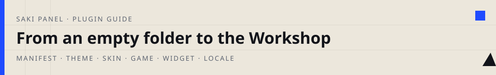
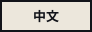

<p align="center">
  
</p>

<p align="center">
  <a href="./README.md"></a>
  &nbsp;
  <a href="./README.en.md"></a>
</p>

<p align="center">
  
</p>

The folders in this repository are finished plugins. Yours is a directory, a manifest, and the files the panel reads for that `type`. The rest of this page is how to write those files so the Workshop can load them. Open a sample only when you need to see a filled-in copy of a rule you just read.

<p align="center">
  <a href="#0-something-the-panel-can-see-in-ten-minutes">Ten minutes</a>
  ·
  <a href="#1-how-the-panel-loads-a-plugin">Load</a>
  ·
  <a href="#2-the-manifest">Manifest</a>
  ·
  <a href="#3-writing-a-theme">Theme</a>
  ·
  <a href="#4-writing-a-skin">Skin</a>
  ·
  <a href="#5-writing-a-game">Game</a>
  ·
  <a href="#6-writing-a-widget">Widget</a>
  ·
  <a href="#7-writing-a-locale">Locale</a>
  ·
  <a href="#8-cover-art">Cover</a>
  ·
  <a href="#9-shipping">Ship</a>
</p>

## 0. Something the panel can see in ten minutes

The panel does not read this git working tree. It reads `data/plugins/<plugin-id>/` under the running install. You write there, then refresh the Plugin Workshop.

Create:

```
data/plugins/saki-theme-demo/
  saki-plugin.json
  theme.css
  preview.webp
```

`saki-plugin.json`:

```json
{
  "name": "saki-theme-demo",
  "version": "0.1.0",
  "displayName": "My first theme",
  "description": "Accent colour only, to prove the load path.",
  "author": "Your name",
  "type": "theme",
  "icon": "preview.webp",
  "minPanelVersion": "3.5.0",
  "theme": {
    "css": "theme.css",
    "htmlClass": "saki-plugin-theme-demo"
  }
}
```

`theme.css`:

```css
html.saki-plugin-theme-demo {
  --primary: #1f4bff !important;
  --primary-hover: #1636c9 !important;
  --primary-light: rgba(31, 75, 255, 0.14) !important;
}
```

`preview.webp` should be a **4:3 landscape** image, 1600×1200. A missing cover looks poor on the card; it does not block loading.

Open the Plugin Workshop. You should see “My first theme”. Click **Apply theme**. If the accent turns from pink to blue, the manifest, the stylesheet and `htmlClass` all connected. Sidebar, login and radii are extra rules in the same file.

`name` becomes the plugin id and the folder name. Only letters, digits, underscores and hyphens; it must start with a letter or a digit. Do not rename it after install — that is a different plugin.

> [!IMPORTANT]
> After you change CSS, images or JSON the browser may keep the old file. Bump `version` from `0.1.0` to `0.1.1` and refresh. Theme, skin and cover URLs all carry `?v=`.

## 1. How the panel loads a plugin

The installer walks a GitHub repository for `saki-plugin.json`, at most five directories deep. The folder that contains the file is the plugin root; it does not search inside that folder afterwards. Do not hide a second manifest under another plugin’s `assets/`.

One repository may hold many plugins. This one does:

```
saki-plugins/
  registry.json
  plugins/
    saki-skin-maid/
    saki-theme-geo/
    saki-game-fruit-slice/
    saki-locale-ja/
```

`owner/repo` in the Workshop installs every plugin it finds. One plugin only: `owner/repo:plugin-name`, for example `EthanChan050430/saki-plugins:saki-theme-geo`.

After install:

| `type` you wrote | What the panel does | What you still click |
| --- | --- | --- |
| `theme` | Injects a `<link>` to your CSS and adds `htmlClass` on `<html>` | **Apply theme**. Only one at a time. The login page fetches it before sign-in. |
| `skin` | Replaces files by `/assets/`-relative path | **Change appearance**. Only one at a time. Missing paths stay stock. |
| `game` | Opens `game.entry` in a sandboxed iframe | **Play**, or Saki’s phone. |
| `widget` | Same sandbox iframe | **Enable**. There is no Apply. |
| `locale` | Registers the JSON dictionary in the language list | **Enable**, then **System settings → Panel language**. |

Theme and skin are “the one in use”. Games, locales and widgets stay mounted while enabled.

Static files are served at:

```
/api/plugins/<id>/assets/<path-from-plugin-root>?v=<version>
```

A wrong relative path is a 404 and a blank iframe.

## 2. The manifest

The file must be named `saki-plugin.json`, sit at the plugin root, and be UTF-8 with no comments. Missing `name`, `type` or `displayName` makes the installer skip the folder.

```json
{
  "name": "saki-theme-demo",
  "version": "0.1.0",
  "displayName": "Name on the card",
  "description": "One sentence.",
  "author": "Your name",
  "type": "theme",
  "icon": "preview.webp",
  "homepage": "https://github.com/you/repo",
  "minPanelVersion": "3.5.0"
}
```

`type` is `theme`, `skin`, `game`, `widget` or `locale`. Then add that block. Sample plugins set `minPanelVersion` to `3.5.0`. `version` is appended to asset URLs.

The next five sections are: which files you create, what you put in them, what the panel does after it reads them, and how you know it worked.

## 3. Writing a theme

You are not swapping the pink. You are handing over a stylesheet that redraws the sidebar, top bar, buttons, dialogs and login page.

Minimum tree:

```
saki-theme-demo/
  saki-plugin.json
  preview.webp
  theme.css
```

Theme block:

```json
{
  "theme": {
    "css": "theme.css",
    "htmlClass": "saki-plugin-theme-demo",
    "backgrounds": {
      "light": "bg-light.webp",
      "dark": "bg-dark.webp"
    }
  }
}
```

`css` is relative to the plugin root. `htmlClass` must start with `saki-plugin-theme-`, then letters, digits, underscores or hyphens. If the shape is wrong, the class is never added and none of your selectors match.

`backgrounds` is optional. When present, the panel sets on `<html>`:

```css
--plugin-theme-bg-light: url("/api/plugins/.../bg-light.webp");
--plugin-theme-bg-dark: url("/api/plugins/.../bg-dark.webp");
```

Wire those into `--app-background-image` in your CSS. Omit them and the stock wallpaper stays.

### First cut: tokens

The liquid-glass sheet uses a lot of `!important`. Your file is injected after it, but selectors still need to be specific, and tokens usually need `!important` too:

```css
html.saki-plugin-theme-demo {
  --primary: #1f4bff !important;
  --primary-hover: #1636c9 !important;
  --primary-light: rgba(31, 75, 255, 0.14) !important;
  --radius-control: 0px !important;
  --radius-modal: 0px !important;
  --radius-card: 0px !important;
  --glass-bg: #fffaf0 !important;
  --glass-border: #12141a !important;
  --surface-bg: #fffaf0 !important;
  --text-dark: #12141a !important;
  --app-background-image: var(--plugin-theme-bg-light) !important;
}

html.saki-plugin-theme-demo[data-theme="dark"] {
  --primary: #6b8cff !important;
  --app-background-image: var(--plugin-theme-bg-dark) !important;
}
```

At this point the accent and radii move. The sidebar often stays glass. That is expected: many rules name selectors directly and never read a token.

### Second cut: name the chrome

Override the nodes you can see. Common classes: `.sidebar`, `.topbar-inner`, `.primary-button`, `.modal-panel`, `.login-container`, `.glass-panel`, `.instance-card`.

```css
html.saki-plugin-theme-demo .sidebar {
  background: #12141a !important;
  border-radius: 0 !important;
  backdrop-filter: none !important;
}

html.saki-plugin-theme-demo .primary-button {
  background: var(--primary) !important;
  border: 2px solid #12141a !important;
  border-radius: 0 !important;
}
```

Dark mode: `html.saki-plugin-theme-demo[data-theme="dark"]`. A bare `[data-theme="dark"]` fights the panel’s own dark sheet.

Do not clip the character:

```css
html.saki-plugin-theme-demo .saki-character-art,
html.saki-plugin-theme-demo .saki-character-art img {
  clip-path: none !important;
}
```

### How you know it worked

After Apply, look at the sidebar, a primary button, any dialog, then sign out and look at login. If all four moved, you wrote a theme. Disable it and the glass should return intact.

## 4. Writing a skin

A skin is not “a folder of drawings”. The panel replaces `/assets/expression/happy.webp` (and the rest of that tree) with your file when the relative path is listed. Unlisted paths stay stock.

Start with the smallest skin that can prove the overlay: hover art. The launcher hover image is `saki_click.webp`.

```
saki-skin-demo/
  saki-plugin.json
  preview.webp
  saki_click.webp
```

```json
{
  "type": "skin",
  "skin": {
    "assetRoot": "",
    "files": ["saki_click.webp", "preview.webp"]
  }
}
```

`assetRoot` is a prefix inside the plugin. Empty means `saki_click.webp` sits at the plugin root and maps to `/assets/saki_click.webp`. If everything lives under `art/`, set `"assetRoot": "art"` and store `art/saki_click.webp`.

Copy into `data/plugins/saki-skin-demo/`, refresh the Workshop, click **Change appearance**. Hover the Saki launcher. You should see your file. If not: `files` omitted the path, the path does not match `/assets/`, or `version` was not bumped.

> [!WARNING]
> Do not use `skin.mapping` to point a missing pose at a different drawing. Leave gaps as the original. Hover is not `pet/hover.webp`.

### Adding expressions

Stills go in `expression/<name>.webp`. A six-frame cycle must be:

```
expression/anim/<name>_f1.webp
expression/anim/<name>_f2.webp
...
expression/anim/<name>_f6.webp
```

Frames for `think` are `think_f1`, not `thinking_f1`. Every file you add belongs in `skin.files`. The panel covers from that list; an unlisted path is not shipped.

<details>
<summary>Paths the panel actually reads</summary>

Root: `head.webp`, `sakiicon.webp`, `sakiicon2.webp`, `saki_click.webp`, `tiebian.webp`, `hang.webp`, `lie.webp`, `saki_files.webp`, `shuru.webp`, `shuru_sit.webp`.

`expression/` stills: `normal`, `think`, `worry`, `happy`, `shy`, `wink`, `cry`, `surprised`, `pout`, `OK`, `sorry`, `sleepy`, `eating`, `working`, `reading`, `checkfiles`, `gaming`, `listen`, `waiting`, `writing`, `terminal`, `search`, `diagnose`, `rollback`, `blocked`, `singing`, `upset`, `middlefinger`, `pickup1`, `pickup2`, `speaking1`, `speaking2`, `empty_healthy`, `empty_instances`, `empty_tasks`, `empty_logs`, `daemon_offline`, `page_404`.

Cycles: `happy`, `shy`, `wink`, `surprised`, `pout`, `sorry`, `cry`, `eating`, `sleepy`, `OK`, `think`, `worry`, `working`, `reading`, `checkfiles`, `upset`, `gaming`, `listen`, `waiting`, `writing`, `terminal`, `search`, `diagnose`, `rollback`, `blocked`, `middlefinger`, `singing`.

`pet/`: `idle`, `hover`, `sit`, `sleep`, `lie`, `hang`, `look`, `run`, `roll`, `walk`, `walk2`, `walk3`, `climb`, `fall`, `pickup`, `happy`, `shy`, `poke`, `yawn`, `pout`, `blink`, `drink`, `doctor`, `eat`, `bath`. `walk`, `climb`, `bath`, `doctor` and `eat` also have `_f1`–`_f6`.

</details>

Use webp. Key the edges. Only one skin is active.

## 5. Writing a game

A game is an HTML page that can open on its own. The panel puts it in an iframe with `allow-scripts allow-pointer-lock` and **without** `allow-same-origin`. You cannot see the parent page, cookies, or the parent’s `localStorage`. Scores live in memory and die on refresh.

```
saki-game-demo/
  saki-plugin.json
  preview.webp
  index.html
  assets/
    player.webp
```

```json
{
  "type": "game",
  "game": {
    "entry": "index.html",
    "title": "My game",
    "width": 720,
    "height": 540
  }
}
```

`entry` is relative to the plugin root. `width` / `height` size the first window, not the canvas. Refresh in the Workshop reloads the iframe.

Assets in `index.html` are relative to that file:

```html
<!DOCTYPE html>
<html lang="en">
<head>
  <meta charset="UTF-8" />
  <meta name="viewport" content="width=device-width, initial-scale=1" />
  <title>demo</title>
  <style>
    html, body { margin: 0; height: 100%; background: #111; color: #fff; }
  </style>
</head>
<body>
  <canvas id="c"></canvas>
  <script>
    const img = new Image();
    img.src = "assets/player.webp";
  </script>
</body>
</html>
```

Do not write `/assets/player.webp` — that is the panel tree. On a white screen, open:

```
/api/plugins/saki-game-demo/assets/index.html
/api/plugins/saki-game-demo/assets/assets/player.webp
```

404 means the path is wrong. Enabled games also appear on Saki’s phone; the icon is `icon` from the manifest.

Do not call login APIs on other origins. Request pointer lock after a click on the canvas.

## 6. Writing a widget

Same sandbox as a game. The block is `widget`:

```json
{
  "type": "widget",
  "widget": {
    "entry": "index.html",
    "mountPoint": "dashboard",
    "width": 360,
    "height": 260
  }
}
```

`mountPoint` is `dashboard`, `sidebar` or `settings`. `height` is the card body; expand uses about 1.5×. The Workshop only enables or disables it. Asset paths follow the game rules. There is no widget sample in this repository yet.

## 7. Writing a locale

A locale is not a translated README. It adds an option to the panel language list. Three languages ship: Simplified Chinese, Traditional Chinese, English. After you enable the pack, **System settings → Panel language** (and the login selector) shows `label`.

Ship a tiny pack first — a handful of keys — so you know the dropdown and `t()` work, then fill the dictionary.

```
saki-locale-fr/
  saki-plugin.json
  fr.json
  preview.webp
```

```json
{
  "name": "saki-locale-fr",
  "version": "0.1.0",
  "displayName": "Français",
  "description": "French UI.",
  "author": "Your name",
  "type": "locale",
  "icon": "preview.webp",
  "minPanelVersion": "3.5.0",
  "locale": {
    "language": "fr-FR",
    "translations": "fr.json",
    "label": "Français"
  }
}
```

`language` is BCP 47 and becomes the option value. `translations` is a JSON path inside the plugin.

`fr.json` is a flat object, not nested:

```json
{
  "nav.dashboard": "Aperçu",
  "nav.instances": "Instances",
  "common.save": "Enregistrer",
  "common.cancel": "Annuler",
  "auth.loginSubmit": "Connexion",
  "settings.language": "Langue du panneau",
  "扩展工坊": "Atelier d’extensions"
}
```

Write both kinds of key:

1. i18n keys for `t("nav.dashboard")`. The full list is the `zh-CN` object in `apps/web/src/i18n/translations.ts`. Frequent prefixes: `common`, `nav`, `auth`, `account`, `users`, `roles`, `settings`, `view`, `context`.
2. Chinese phrases still rewritten from the DOM, such as `扩展工坊`. The key must match the source, punctuation included.

Missing keys fall back to Simplified Chinese. Translate navigation, sign-in and common buttons first.

Switching — skip a step and the UI will not move:

1. **Enable** the pack in the Workshop.
2. Open **System settings**, **Panel language**.
3. Choose `fr-FR` (or whatever you put in `language`).
4. Before disabling the pack, switch away if that language is selected, or the option vanishes under a dictionary that is already gone.

Do not install two packs for the same `language`. The Japanese file `plugins/saki-locale-ja/ja.json` shows how dense a dictionary can get; you do not have to copy its shape.

## 8. Cover art

`icon` is drawn with `object-fit: cover` on the Workshop card. Use a **4:3 landscape** webp, 1600×1200 if you can. Keep the subject off the trim. A cut-out on black becomes an ugly slice. Do not paint the plugin name on the image; `displayName` already has it.

## 9. Shipping

Once it works locally, two routes.

**Your own GitHub repository.** Paste the URL into the Workshop. A valid manifest is enough. Several plugins in one repo are fine.

**Featured in this repository.** Fork, branch from `master`, put a self-contained plugin in `plugins/<name>/`. Add a row to `registry.json` whose `name` matches the manifest:

```json
{
  "name": "saki-theme-demo",
  "displayName": "My first theme",
  "description": "One sentence.",
  "author": "Your name",
  "type": "theme",
  "version": "0.1.0",
  "repo": "EthanChan050430/saki-plugins",
  "ref": "master",
  "icon": "preview.webp",
  "featured": true
}
```

After merge, `repo` still points here. In the pull request say the type, which pages you opened, and what you expected to see. Skip editor junk and uncompressed originals. Themes should not clip the face. Skins should not stand in one pose for another. Bump `version` when files change; the panel watches the commit or that field.
