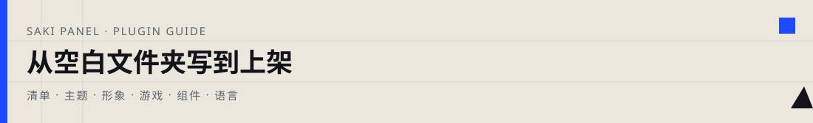
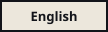

<p align="center">
  
</p>

<p align="center">
  <a href="./README.md"></a>
  &nbsp;
  <a href="./README.en.md"></a>
</p>

<p align="center">
  
</p>

这个仓库里的每个文件夹，都是一份已经做好的成品插件。你要做的插件其实很简单：**一个文件夹 + 一份清单文件 + 对应类型的几个文件**。下面会一步步教你，怎么从空文件夹写到能在扩展工坊里点出来。写完某一类之后，可以翻到仓库里对应的样例对照一下，看看自己漏了什么。

<p align="center">
  <a href="#0-十分钟做出能被面板看见的东西">十分钟上手</a>
  ·
  <a href="#1-面板到底怎么加载插件">加载原理</a>
  ·
  <a href="#2-清单文件要写什么">清单</a>
  ·
  <a href="#3-写主题">主题</a>
  ·
  <a href="#4-写形象">形象</a>
  ·
  <a href="#5-写游戏">游戏</a>
  ·
  <a href="#6-写组件">组件</a>
  ·
  <a href="#7-写语言包">语言</a>
  ·
  <a href="#8-封面图">封面</a>
  ·
  <a href="#9-发布与贡献">发布</a>
</p>

---

## 0. 十分钟做出能被面板看见的东西

> 面板**不会**读这个 GitHub 仓库里的文件。它只读你电脑上运行目录里的 `data/plugins/插件名/`。所以开发流程就是：在那个文件夹里写文件，然后刷新扩展工坊。

先建一个最小的主题插件目录：

```
data/plugins/saki-theme-demo/
  saki-plugin.json
  theme.css
  preview.webp
```

`saki-plugin.json`（插件清单）：

```json
{
  "name": "saki-theme-demo",
  "version": "0.1.0",
  "displayName": "我的第一份主题",
  "description": "只改主色，用来确认加载流程通不通。",
  "author": "你的名字",
  "type": "theme",
  "icon": "preview.webp",
  "minPanelVersion": "3.5.0",
  "theme": {
    "css": "theme.css",
    "htmlClass": "saki-plugin-theme-demo"
  }
}
```

`theme.css`（主题样式）：

```css
html.saki-plugin-theme-demo {
  --primary: #1f4bff !important;
  --primary-hover: #1636c9 !important;
  --primary-light: rgba(31, 75, 255, 0.14) !important;
}
```

`preview.webp` 先放一张 **4:3 横版** 的图，1600×1200 就行。没图的话工坊卡片会很难看，但不影响插件加载。

然后打开扩展工坊，应该能看到「我的第一份主题」。点 **应用主题**，如果主色从粉色变成蓝色，就说明清单、CSS、htmlClass 这三步都走通了。之后想加侧栏、登录页、圆角，都在这份 CSS 里接着写。

<div style="background:#faf8f3;border:1px solid #ece4d3;border-left:3px solid #c99a2e;border-radius:4px;padding:14px 18px;margin:20px 0;">
  <strong style="color:#8a6a18;">关于 <code>name</code> 字段</strong><br>
  <code>name</code> 会变成插件的 id，也是文件夹名。只能用字母、数字、下划线、连字符，而且必须以字母或数字开头。<strong>装好之后不要随便改 <code>name</code></strong>，改了就等于换了一个新插件，旧的还在。
</div>

> [!IMPORTANT]
> 改完 CSS / 图片 / JSON 之后，浏览器可能还在用旧缓存。把 `version` 从 `0.1.0` 改成 `0.1.1` 再刷新就行。主题、形象、封面图的地址都带了 `?v=版本号`，改版本号就能强制刷新。

## 1. 面板到底怎么加载插件

安装器会在 GitHub 仓库里递归找 `saki-plugin.json`（最多往下找五层）。找到一份，那一层就是插件根目录，**不会再往这个目录里面搜了**。所以别把第二份清单塞进第一份的 `assets/` 文件夹里。

一个仓库可以放很多个插件，本仓库就是这样：

```
saki-plugins/
  registry.json
  plugins/
    saki-skin-maid/        ← 这里有清单
    saki-theme-geo/
    saki-game-fruit-slice/
    saki-locale-ja/
```

在工坊里填 `所有者/仓库`，会把能找到的插件都装上。只想装一个的话：`所有者/仓库:插件名`，比如 `EthanChan050430/saki-plugins:saki-theme-geo`。

装完之后，不同类型的插件行为不一样：

<table style="border-collapse:collapse;width:100%;font-size:14px;margin:8px 0;">
  <tr>
    <th width="120" style="text-align:left;padding:10px 14px;border-bottom:2px solid #1f4bff;color:#1f4bff;">你写的 type</th>
    <th style="text-align:left;padding:10px 14px;border-bottom:2px solid #1f4bff;color:#1f4bff;">面板会做什么</th>
    <th style="text-align:left;padding:10px 14px;border-bottom:2px solid #1f4bff;color:#1f4bff;">你还要点一下</th>
  </tr>
  <tr>
    <td style="padding:10px 14px;border-bottom:1px solid #eef0f4;vertical-align:top;"><code>theme</code></td>
    <td style="padding:10px 14px;border-bottom:1px solid #eef0f4;vertical-align:top;">插入一个 <code>&lt;link&gt;</code> 指向你的 CSS，给 <code>&lt;html&gt;</code> 加上 <code>htmlClass</code></td>
    <td style="padding:10px 14px;border-bottom:1px solid #eef0f4;vertical-align:top;"><strong>应用主题</strong>。同时只能用一套。登录页没登录时也会加载当前主题。</td>
  </tr>
  <tr>
    <td style="padding:10px 14px;border-bottom:1px solid #eef0f4;vertical-align:top;"><code>skin</code></td>
    <td style="padding:10px 14px;border-bottom:1px solid #eef0f4;vertical-align:top;">按 <code>/assets/</code> 下的相对路径替换图片</td>
    <td style="padding:10px 14px;border-bottom:1px solid #eef0f4;vertical-align:top;"><strong>更换形象</strong>。同时只能用一套。没提供的路径还是用原图。</td>
  </tr>
  <tr>
    <td style="padding:10px 14px;border-bottom:1px solid #eef0f4;vertical-align:top;"><code>game</code></td>
    <td style="padding:10px 14px;border-bottom:1px solid #eef0f4;vertical-align:top;">用沙箱 iframe 打开 <code>game.entry</code></td>
    <td style="padding:10px 14px;border-bottom:1px solid #eef0f4;vertical-align:top;"><strong>开始游玩</strong>，或者在 Saki 手机里打开。</td>
  </tr>
  <tr>
    <td style="padding:10px 14px;border-bottom:1px solid #eef0f4;vertical-align:top;"><code>widget</code></td>
    <td style="padding:10px 14px;border-bottom:1px solid #eef0f4;vertical-align:top;">同样是沙箱 iframe</td>
    <td style="padding:10px 14px;border-bottom:1px solid #eef0f4;vertical-align:top;"><strong>启用</strong>。没有「应用」按钮。</td>
  </tr>
  <tr>
    <td style="padding:10px 14px;border-bottom:1px solid #eef0f4;vertical-align:top;"><code>locale</code></td>
    <td style="padding:10px 14px;border-bottom:1px solid #eef0f4;vertical-align:top;">把 JSON 词典加入语言列表</td>
    <td style="padding:10px 14px;border-bottom:1px solid #eef0f4;vertical-align:top;"><strong>启用</strong>，再去 <strong>系统设置 → 面板语言</strong> 里选。</td>
  </tr>
</table>

简单说：**主题和形象**是「当前正在用的那一套」，**游戏、语言、组件**是「启用了就挂着运行」。

插件里的静态文件通过这个地址访问：

```
/api/plugins/<id>/assets/<相对插件根的路径>?v=<version>
```

游戏、主题、封面图都走这条。相对路径写错就是 404，iframe 里白屏。

## 2. 清单文件要写什么

文件名必须是 `saki-plugin.json`，放在插件根目录，UTF-8 编码，不能有注释。缺了 `name`、`type`、`displayName` 会被当成无效插件跳过。

```json
{
  "name": "saki-theme-demo",
  "version": "0.1.0",
  "displayName": "显示在卡片上的名字",
  "description": "一句话介绍。",
  "author": "你的名字",
  "type": "theme",
  "icon": "preview.webp",
  "homepage": "https://github.com/you/repo",
  "minPanelVersion": "3.5.0"
}
```

`type` 只能是下面五种之一，然后补上对应的配置块：

<div style="display:flex;flex-wrap:wrap;gap:8px;margin:14px 0;">
  <span style="background:#eef0fa;border:1px solid #c7ccef;color:#3b44b8;padding:5px 14px;border-radius:999px;font-size:13px;font-weight:500;">theme 主题</span>
  <span style="background:#eef7f1;border:1px solid #c2e2cb;color:#1e7a3a;padding:5px 14px;border-radius:999px;font-size:13px;font-weight:500;">skin 形象</span>
  <span style="background:#faf4ef;border:1px solid #f0d7c2;color:#a8542a;padding:5px 14px;border-radius:999px;font-size:13px;font-weight:500;">game 游戏</span>
  <span style="background:#eef5fa;border:1px solid #c2dcec;color:#2a6a9a;padding:5px 14px;border-radius:999px;font-size:13px;font-weight:500;">widget 组件</span>
  <span style="background:#faf0f7;border:1px solid #e8c5de;color:#9a3a7a;padding:5px 14px;border-radius:999px;font-size:13px;font-weight:500;">locale 语言</span>
</div>

样例插件都把 `minPanelVersion` 写成 `3.5.0`。

下面五节会分别讲：每种类型要新建哪些文件、里面写什么、面板读完之后会发生什么、怎么确认它生效了。

## 3. 写主题

主题不是只换一个粉色。你要交一份 CSS，让侧栏、顶栏、按钮、对话框、登录页都按你的规则来画。

最小目录结构：

```
saki-theme-demo/
  saki-plugin.json
  preview.webp
  theme.css
```

清单里的主题配置块：

```json
{
  "theme": {
    "css": "theme.css",
    "htmlClass": "saki-plugin-theme-demo",
    "backgrounds": {
      "light": "bg-light.webp",
      "dark": "bg-dark.webp"
    }
  }
}
```

- `css` 是相对插件根目录的路径。
- `htmlClass` 必须以 `saki-plugin-theme-` 开头，后面只能是字母、数字、下划线、连字符。写错了面板不会往 `<html>` 上加 class，你的 CSS 选择器就全都不生效。
- `backgrounds` 可选。写了之后，面板会在 `<html>` 上设置两个变量，你在 CSS 里把它们接到 `--app-background-image` 上就行。不写就继续用面板自带的背景。

```css
--plugin-theme-bg-light: url("/api/plugins/.../bg-light.webp");
--plugin-theme-bg-dark: url("/api/plugins/.../bg-dark.webp");
```

### 第一步：改 CSS 变量

面板自带的液态玻璃样式写了很多 `!important`。你的 CSS 虽然是后面插入的，但选择器还是要够具体，变量也建议带上 `!important`：

```css
html.saki-plugin-theme-demo {
  --primary: #1f4bff !important;
  --primary-hover: #1636c9 !important;
  --primary-light: rgba(31, 75, 255, 0.14) !important;
  --radius-control: 0px !important;
  --radius-modal: 0px !important;
  --radius-card: 0px !important;
  --glass-bg: #fffaf0 !important;
  --glass-border: #12141a !important;
  --surface-bg: #fffaf0 !important;
  --text-dark: #12141a !important;
  --app-background-image: var(--plugin-theme-bg-light) !important;
}

html.saki-plugin-theme-demo[data-theme="dark"] {
  --primary: #6b8cff !important;
  --app-background-image: var(--plugin-theme-bg-dark) !important;
}
```

写到这里，按钮主色和圆角会跟着变，但侧栏多半还是玻璃质感的。这是正常的——很多样式是直接写死了选择器，不读变量。

### 第二步：直接改具体的界面元素

把你看得见的块直接覆盖掉。常见的 class 有 `.sidebar`、`.topbar-inner`、`.primary-button`、`.modal-panel`、`.login-container`、`.glass-panel`、`.instance-card`。

```css
html.saki-plugin-theme-demo .sidebar {
  background: #12141a !important;
  border-radius: 0 !important;
  backdrop-filter: none !important;
}

html.saki-plugin-theme-demo .primary-button {
  background: var(--primary) !important;
  border: 2px solid #12141a !important;
  border-radius: 0 !important;
}
```

深色模式用 `html.saki-plugin-theme-demo[data-theme="dark"]`。别只写 `[data-theme="dark"]`，会和面板自己的深色规则打架。

还有，别裁切角色立绘：

```css
html.saki-plugin-theme-demo .saki-character-art,
html.saki-plugin-theme-demo .saki-character-art img {
  clip-path: none !important;
}
```

### 怎么知道写对了

应用主题后看这四个地方：**侧栏背景、主按钮、随便一个对话框、退出后看登录页**。四处都变了，才算是真正的主题，而不只是换了个颜色。关掉主题，粉色玻璃应该完整地回来。

## 4. 写形象

形象不是「交一套立绘文件夹」这么简单。面板会把 `/assets/expression/happy.webp` 这类路径替换成你插件里的文件。规则是：**清单里出现过的相对路径才会被覆盖，没出现的还是用原图**。

先做一个最小能跑的形象——只换悬停图。启动器鼠标移上去用的是 `saki_click.webp`。

```
saki-skin-demo/
  saki-plugin.json
  preview.webp
  saki_click.webp
```

```json
{
  "type": "skin",
  "skin": {
    "assetRoot": "",
    "files": ["saki_click.webp", "preview.webp"]
  }
}
```

- `assetRoot` 是插件内部的前缀。空字符串表示 `saki_click.webp` 就在插件根目录，对应面板的 `/assets/saki_click.webp`。如果你把图都放在 `art/` 文件夹下，就写 `"assetRoot": "art"`，文件就是 `art/saki_click.webp`。

把插件拷进 `data/plugins/saki-skin-demo/`，刷新工坊，点 **更换形象**。鼠标移到 Saki 启动器上，应该能看到你那张图。如果看不到，检查这三点：`files` 里有没有写这个路径、路径是不是和 `/assets/` 对齐了、`version` 有没有改。

> [!WARNING]
> 不要用 `skin.mapping` 把缺失的动作指到另一张图上。缺文件就让原版留下来。另外，悬停图是 `saki_click.webp`，不是 `pet/hover.webp`，别搞混了。

### 继续加表情

静图放在 `expression/<名字>.webp`。六帧循环动画必须是：

```
expression/anim/<名字>_f1.webp
expression/anim/<名字>_f2.webp
...
expression/anim/<名字>_f6.webp
```

注意 `think` 的帧是 `think_f1`，不是 `thinking_f1`。每加一张图，都要写进 `skin.files` 里。面板靠这份清单做覆盖，不写等于没交。

<details>
<summary><strong>面板会读取的所有路径（点击展开）</strong></summary>

**根目录**：`head.webp`，`sakiicon.webp`，`sakiicon2.webp`，`saki_click.webp`，`tiebian.webp`，`hang.webp`，`lie.webp`，`saki_files.webp`，`shuru.webp`，`shuru_sit.webp`。

**`expression/` 静图**：`normal`，`think`，`worry`，`happy`，`shy`，`wink`，`cry`，`surprised`，`pout`，`OK`，`sorry`，`sleepy`，`eating`，`working`，`reading`，`checkfiles`，`gaming`，`listen`，`waiting`，`writing`，`terminal`，`search`，`diagnose`，`rollback`，`blocked`，`singing`，`upset`，`middlefinger`，`pickup1`，`pickup2`，`speaking1`，`speaking2`，`empty_healthy`，`empty_instances`，`empty_tasks`，`empty_logs`，`daemon_offline`，`page_404`。

**六帧循环动画**：`happy`，`shy`，`wink`，`surprised`，`pout`，`sorry`，`cry`，`eating`，`sleepy`，`OK`，`think`，`worry`，`working`，`reading`，`checkfiles`，`upset`，`gaming`，`listen`，`waiting`，`writing`，`terminal`，`search`，`diagnose`，`rollback`，`blocked`，`middlefinger`，`singing`。

**`pet/` 桌宠**：`idle`，`hover`，`sit`，`sleep`，`lie`，`hang`，`look`，`run`，`roll`，`walk`，`walk2`，`walk3`，`climb`，`fall`，`pickup`，`happy`，`shy`，`poke`，`yawn`，`pout`，`blink`，`drink`，`doctor`，`eat`，`bath`。其中 `walk`、`climb`、`bath`、`doctor`、`eat` 另有 `_f1`–`_f6` 六帧。

</details>

图片用 webp 格式，透明边扣干净。同一时刻只能用一套形象。

## 5. 写游戏

游戏就是一份能单独在浏览器打开的 HTML。面板把它放进 iframe，沙箱权限是 `allow-scripts allow-pointer-lock`，**没有** `allow-same-origin`。也就是说：你碰不到父页面、Cookie、父域的 `localStorage`。分数要存的话，只能存在内存里，刷新就没了。

```
saki-game-demo/
  saki-plugin.json
  preview.webp
  index.html
  assets/
    player.webp
```

```json
{
  "type": "game",
  "game": {
    "entry": "index.html",
    "title": "我的游戏",
    "width": 720,
    "height": 540
  }
}
```

- `entry` 相对插件根目录。
- `width` / `height` 只是弹窗初始大小，不是画布上限。工坊的刷新会重载 iframe。

`index.html` 里的资源路径必须相对这份 HTML 本身：

```html
<!DOCTYPE html>
<html lang="zh-CN">
<head>
  <meta charset="UTF-8" />
  <meta name="viewport" content="width=device-width, initial-scale=1" />
  <title>demo</title>
  <style>
    html, body { margin: 0; height: 100%; background: #111; color: #fff; }
  </style>
</head>
<body>
  <canvas id="c"></canvas>
  <script>
    const img = new Image();
    img.src = "assets/player.webp";
  </script>
</body>
</html>
```

<div style="background:#faf6f6;border:1px solid #ecd5d5;border-left:3px solid #b5453a;border-radius:4px;padding:14px 18px;margin:20px 0;">
  <strong style="color:#8a2e25;">路径别写错</strong><br>
  不要写成 <code>/assets/player.webp</code>，那是面板自己的目录，不是你的插件。白屏的时候，用浏览器开发者工具直接打开这两个地址看看：
  <pre style="background:#1e1e1e;color:#e0e0e0;padding:10px;border-radius:4px;margin:8px 0;overflow-x:auto;font-size:13px;">/api/plugins/saki-game-demo/assets/index.html
/api/plugins/saki-game-demo/assets/assets/player.webp</pre>
  如果是 404，就是路径写错了。
</div>

游戏启用后也会出现在 Saki 手机的列表里，图标用的是清单里的 `icon`。

不要去调需要登录的跨域 API。指针锁定要等用户点击画布之后再请求。

## 6. 写组件

组件和游戏用的是同一套 iframe 沙箱。只要把清单里的类型换成 `widget`：

```json
{
  "type": "widget",
  "widget": {
    "entry": "index.html",
    "mountPoint": "dashboard",
    "width": 360,
    "height": 260
  }
}
```

- `mountPoint` 可以是 `dashboard`（仪表盘）、`sidebar`（侧栏）或 `settings`（设置页）。
- `height` 是卡片内容高度，展开时面板会按大约 1.5 倍来估算。
- 工坊里只有**启用**，没有「应用」。
- 资源路径规则和游戏一样。

本仓库暂时还没有组件成品，按这套规则写就行。

## 7. 写语言包

语言包不是「把 README 翻译一遍」。它是往面板的语言列表里加一个选项。面板内置三种：简体中文、繁体中文、English。你的包启用后，在 **系统设置 → 面板语言**（登录页也有同一处）会出现你写的 `label`。

建议先写一个最小的包，只翻译几条，确认下拉框和 `t()` 都通了，再慢慢补全词典。

```
saki-locale-fr/
  saki-plugin.json
  fr.json
  preview.webp
```

```json
{
  "name": "saki-locale-fr",
  "version": "0.1.0",
  "displayName": "Français",
  "description": "法语界面。",
  "author": "你的名字",
  "type": "locale",
  "icon": "preview.webp",
  "minPanelVersion": "3.5.0",
  "locale": {
    "language": "fr-FR",
    "translations": "fr.json",
    "label": "Français"
  }
}
```

- `language` 用 BCP 47 格式，会成为下拉框的值。
- `translations` 是插件内 JSON 文件的路径。

`fr.json` 是一个扁平对象，不要嵌套：

```json
{
  "nav.dashboard": "Aperçu",
  "nav.instances": "Instances",
  "common.save": "Enregistrer",
  "common.cancel": "Annuler",
  "auth.loginSubmit": "Connexion",
  "settings.language": "Langue du panneau",
  "扩展工坊": "Atelier d’extensions"
}
```

键有两种，两种都写更保险：

1. 给 `t("nav.dashboard")` 用的 i18n 键。完整列表在面板源码 `apps/web/src/i18n/translations.ts` 的 `zh-CN` 段。常用前缀：`common`、`nav`、`auth`、`account`、`users`、`roles`、`settings`、`view`、`context`。
2. 页面上直接替换的中文句子，比如 `扩展工坊`。键必须和原文完全一致，标点也不能差。

缺的键会自动退回简体中文，不用一次译完。

切换语言的步骤，少一步界面都不会变：

1. 在扩展工坊里 **启用** 这份语言包。
2. 打开 **系统设置**，找到 **面板语言**。
3. 选 `fr-FR`（或者你写的 `language` 值）。
4. 停用插件前，如果正在用这种语言，先改回简体或英文。不然选项消失后，界面会停在一种已经卸掉的词典上。

同一个 `language` 不要装两份，后登记的会盖住先登记的。日语成品在 `plugins/saki-locale-ja/ja.json`，可以参考它的词典密度，但不是必须照抄结构。

## 8. 封面图

`icon` 字段对应的图，会被工坊卡片用 `object-fit: cover` 铺满。所以要做成 **4:3 横版** 的 webp，建议 1600×1200。主体放在中间。纯黑底的立绘在卡片里会被裁成一块难看的切片。

<div style="background:#f6f7fb;border:1px solid #e2e6f0;border-left:3px solid #1f4bff;border-radius:4px;padding:14px 18px;margin:20px 0;">
  <strong style="color:#1f4bff;">小提示</strong><br>
  不要把插件名字画进图里，名字已经通过 <code>displayName</code> 显示了。
</div>

## 9. 发布与贡献

本地验证通过之后，有两条路可以走。

**自己的 GitHub 仓库。** 把仓库地址填进工坊，能搜到清单就能装。一个仓放多个插件也行。

**进本仓库的社区精选。** Fork 本仓库，从 `master` 开分支，在 `plugins/<名字>/` 放下一份能独立安装的插件。然后在根目录的 `registry.json` 里加一项，`name` 要和清单里的一样：

```json
{
  "name": "saki-theme-demo",
  "displayName": "我的第一份主题",
  "description": "一句话介绍。",
  "author": "你的名字",
  "type": "theme",
  "version": "0.1.0",
  "repo": "EthanChan050430/saki-plugins",
  "ref": "master",
  "icon": "preview.webp",
  "featured": true
}
```

合进本仓之后，`repo` 保持指向这里。Pull Request 里写清楚：插件类型、你点过哪些页面、预期看到什么。别提交编辑器备份文件和未压缩的原片。主题不要把脸裁掉，形象不要拿错姿势填空缺。改了文件就加 `version`，面板靠提交记录或版本号来判断有没有更新。

写不下去的时候，再打开 `plugins/` 里对应类型的成品，看看它的清单和文件是怎么对上上面这些规则的。
